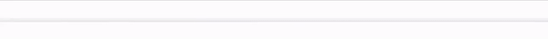
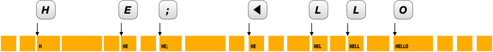
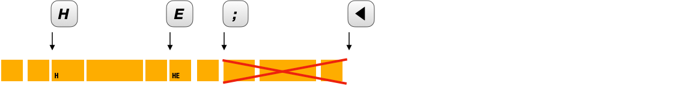
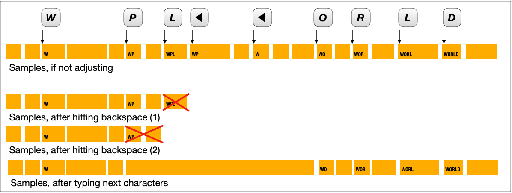

# PerfectTypist: An algorithm to seemingly eliminate typing mistakes when making a screen recording

> [!NOTE]
> This README is based on article originally published at [https://www.linkedin.com/pulse/perfecttypist-algorithm-seemingly-eliminate-typing-mistakes-dan-wood-zghqc/](https://www.linkedin.com/pulse/perfecttypist-algorithm-seemingly-eliminate-typing-mistakes-dan-wood-zghqc/).

Pre-pandemic, as I was going through the fabulous "[100 Days of SwiftUI](https://www.hackingwithswift.com/100/swiftui)" course and other Hacking with Swift videos, I noticed that their creator seemed to be an excellent typist, seemingly never making mistakes. When _I_ record myself typing, I seem to make more typing errors than usual! I realized that you could simply edit your video after it's recorded to cut out the mistakes. But maybe not so simply, because if you were talking while typing, you'd mess up the timing. And even if you didn't worry about the timing, it would still be extremely tedious to go through even a few minutes of video to clean up!

Why not take advantage of the computer, then, to clean up your video, as you were recording it? If there was a way that hitting backspace could signal the video recording software that a mistake had been made, perhaps it could "back up" the recording to just before the incorrect keystroke was hit!

I built a very rough prototype of my idea, but I didn't get very far for two reasons: First, I didn't have the time to build an entire screen-recording application. Second, the screen-recording API we had at the time wasn't particularly full-featured or enjoyable to use.

Apple's newish [ScreenCaptureKit](https://developer.apple.com/documentation/screencapturekit/) makes it a lot easier to record from the screen, so I decided to resurrect my old idea and rewrite it using this newer API.  I still don't have any plans on building this out into a full-fledged screen-recording app, but maybe some of the existing apps in this space (e.g. [ScreenStudio](https://www.screen.studio/), [ScreenFlow](https://www.telestream.net/screenflow/overview.htm), [Loom](https://www.loom.com/lp/mac-screen-recorder-lp)) will incorporate this algorithm into their offerings. I invite their developers to incorporate this as a feature; I think their users would be very happy to have their typing appear to improve!

As a starting point for my code, I used the Apple sample code "Capturing screen content in macOS." Apple recently updated [its page containing the code](https://developer.apple.com/documentation/screencapturekit/capturing_screen_content_in_macos) to require macOS 15 since it incorporates new WWDC24 APIs (microphone input, HDR, etc.). At some point, I may update my code to reflect that sample code, but for now, it's based on the 2023 version of the code, which only requires macOS 13.

Please note that this is still a prototype, just doing the bare minimum to implement the algorithm; it's still clearly a "sample code" application. It doesn't produce the best video quality - it's highly compressed. Some fine-tuning should be easy to do based on what kind of recording is desired.

The Algorithm
-------------

A foundation upon which most of this code is based can be found in a 2018 technical blog post from GIPHY, [Doing it Live at GIPHY (with AVFoundation)](https://engineering.giphy.com/doing-it-live-at-giphy-with-avfoundation/). This article describes their use of a circular buffer to hold the last 30 seconds of frames that their code captures, and a technique for using the Video Toolbox framework to compress the frames. Understanding this technique is essential to understanding the rest of the algorithm.

Instead of capturing frames from the screen and directly writing them to disk, the `ScreenRecorder` spools each frame as it arrives into a `CircularBuffer`. Only when the buffer is full and the oldest frames are displaced — or at the end, when recording is done and the buffer needs to be flushed out — are the frames written to the disk.

When the screen recording is going on, individual frames are recorded from the screen and added to the circular buffer. Shortly after each keystroke, a new letter will appear on the screen, which will mean a new unique frame to be recorded. Other updates to the screen (a popup, movement of the cursor, etc.) may also add additional frames to the buffer.

This timeline, for instance, shows what might happen if somebody tries to type "hello" and makes a mistake that requires backspacing and re-typing the correct letter. A yellow box indicates what text is showing. (Empty yellow boxes represent the same text but slightly different frame content.)

Where the real "magic" happens, though, is that our `KeyboardMonitor` class is paying attention to keystrokes, recording when each keystroke is hit and what video frame that corresponds to.

So when the backspace is hit, the keyboard monitor performs surgery on the circular buffer, wiping out the last frame or frames starting at the moment that the keystroke before the backspace was hit.

When the next (non-backspace) key is pressed, the sample is added to the buffer, at the timestamp that the new keystroke took place. This has the effect of extending that last pre-mistake sample to fill the gap.  So it's as if the mistake never happened!

The typing then continues and it's as if there was a brief pause in the typing, rather than a mistake.

This technique works well for multiple backspaces! Each backspace just goes back to erase one more mistake. Subject to the capacity of the circular buffer, of course.

Limitations and possible improvements
-------------------------------------

This usually ends up looking pretty good. And if the user is talking, there is no synchronization problem because the audio and video timelines do not get adjusted.

I can envision some situations where this technique is a bit problematic, though. For instance, if you are capturing your typing while an animation is happening in the same window, then that animation would appear to freeze during those moments when the frames are being adjusted. Or if you have a noisy keyboard like the [Tactile Pro](http://matias.ca/tactilepro4/) and your microphone is picking up your typing sounds, it might seem a little strange to hear key clicks when there aren't corresponding characters appearing on screen.

A possible improvement might be to monitor the audio that is coming in with the video. If it doesn't appear that the narrator is talking during typing, the buffer might be adjusted to give the illusion that less time passed while the mistake was corrected. The same kind of analysis could be used to automatically speed up all typing frames, so it appears that the typing happens with super speed and super accuracy.

The Code
--------

I've flattened the repository so it's easy to see what changes I made from Apple's sample code. The first check-in is the sample code; the second check-in is where I changed all of the names from 'CaptureSample' to 'PerfectTypist'; on top of that are the changes that implement the new capturing algorithm.

### New Files

`CircularBuffer`

Based on the [Giphy article](https://engineering.giphy.com/doing-it-live-at-giphy-with-avfoundation/). They define a circular buffer so we can always have the last N seconds of captured frames available.  This template class `CircularBuffer<T>` is the basis.

`KeyboardMonitor`

Not surprisingly, the purpose of this class is to monitor the keyboard.  It is passed in a `CircularBuffer` and a `VTCompressionSession`; as keys are pressed, it adjusts the circular buffer and possibly backs up the session.

`VideoToolboxPlus`

Some video utilities from John Manos. \[[Source](https://github.com/jmmanos/VideoToolboxPlus/blob/master/VideoToolboxPlus.swift)\] Updated for newer Swift compatibility. Extensions on `VTCompressionSession` and `CMSampleBuffer`.

### Changed Files

`ScreenRecorder`

*   Manages an `AVAssetWriter` and `AVAssetWriterInput` for writing the captured video
*   Manages a `KeyboardMonitor` and `CircularBuffer<CMSampleBuffer>` for managing the keystrokes and buffering the captured frames
*   Manages a `VTCompressionSession` to compress the frames that get buffered
*   `start()` function sets up the compression session, the circular buffer, and the keyboard monitor.  With each frame received, it compresses the image and adds to the circular buffer. If a frame was displaced from the circular buffer, it's written to the output file.
*   `stop()` function cleans up the compression session, keyboard monitor, and circular buffer
*   minor changes to `streamConfiguration`, `filterWindows()`
*   Several new methods for writing frames to the output file
*   Utility method `flush()` extending `VTCompressionSession`

`CaptureEngine`

*   `CapturedFrame` struct adds a `CMSampleBuffer` and a timestamp, `displayTime`.  Removes `invalid` since it's not used.
*   `func createFrame(for sampleBuffer: CMSampleBuffer)` gets the timestamp from `attachments\[.displayTime\]` and builds a `CapturedFrame` with that additional metadata, and the given sample buffer.

`ContentView`

*   renamed `isUnauthorized` to `isScreenRecordingUnauthorized` (for clarification) and added `isKeyCaptureUnauthorized` since we now have to deal with two permissions
*   Replaced contents of `.overlay` section for authorization to handle screen recording and accessibility permissions. Added some markdown to navigate to the appropriate system settings.
*   To the `Task` in the `.onAppear` for the view:
  *   Insert explicit calling of `await screenRecorder.monitorAvailableContent()` rather than invoking this in the call to `start()` since we are no longer starting capture automatically
  *   initialize `isKeyCaptureUnauthorized` from the accessibility framework
  *   Do not call `await screenRecorder.start()` automatically.

`Views/ConfigurationView`

*   `.onAppear` method to automatically pick TextEdit; useful for demos and testing
*   FPS `Picker` using preset values declared in `fpsValues`
*   `Stepper` to choose buffer size, in seconds
*   Comment out the Content Picker - not working for me and not relevant to my sample
